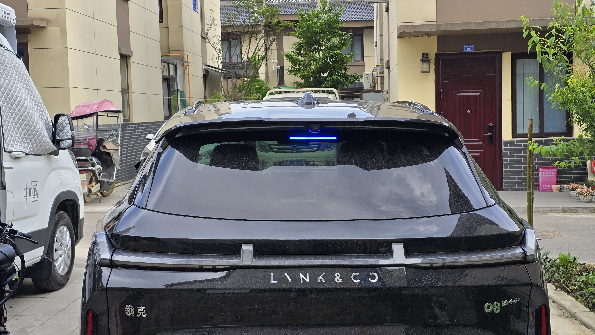
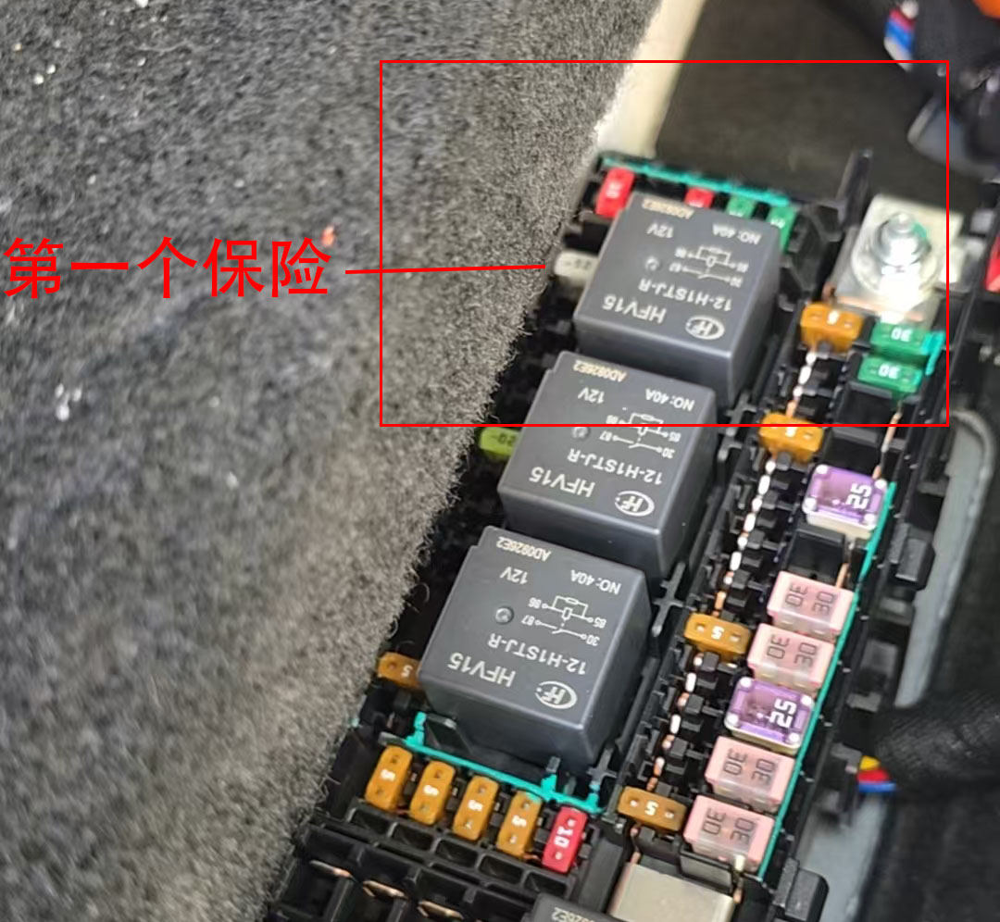
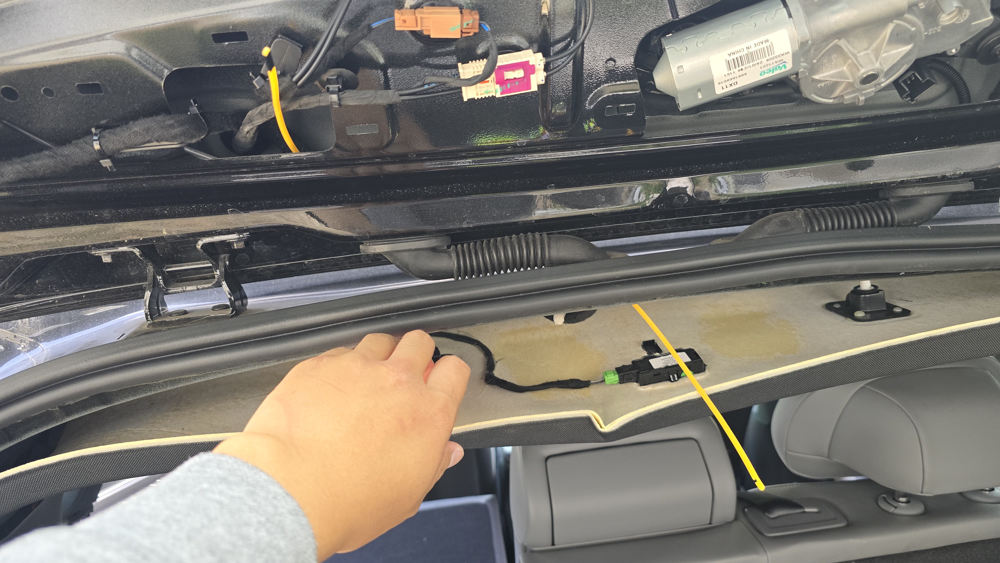
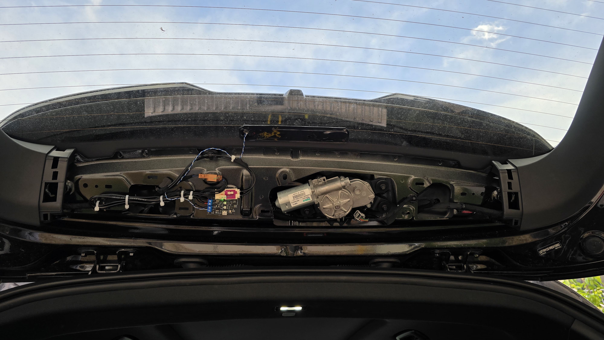
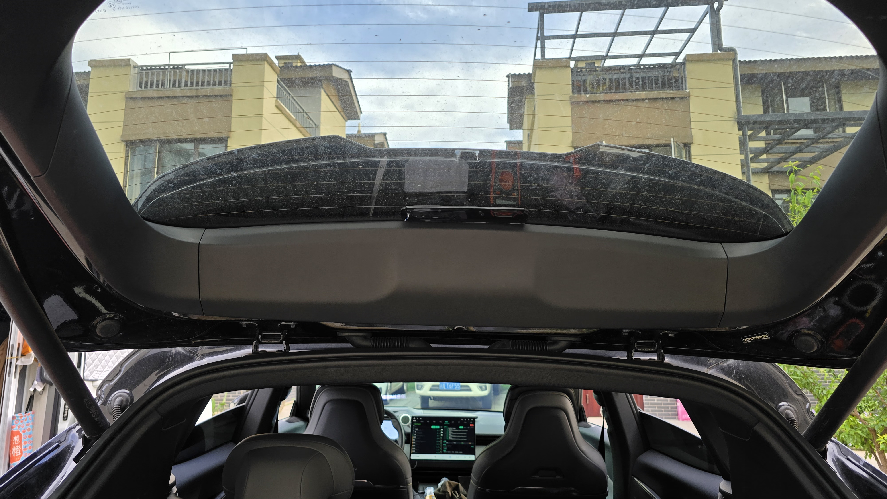
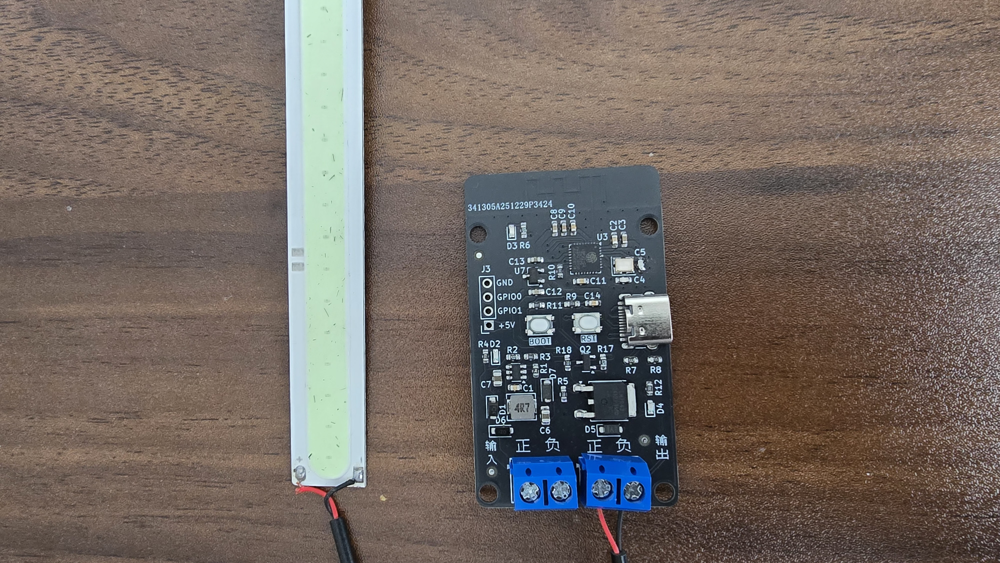

# 🚗 50元实现领克08智驾小蓝灯 | ESP32 + EVCC 超简方案

吉利系智驾小蓝灯加装 —— 为吉利系及领克车型加装的安全警示装置。通过车机端 EVCC（ADB 安装）获取智驾状态数据，经蓝牙 BLE 广播至开发板，自动点亮小蓝灯，提醒周围交通参与者当前车辆正处于智驾或巡航模式。

- **低成本DIY**：开发板与小蓝灯均采用网购成品，即买即用成本控制在50元以下。
- **灵活可控**：支持手动停用，超时自动关灯

> 本项目初衷：正视智驾系统尚不成熟，为长途巡航提供额外安全警示，让每一次辅助驾驶，都多一份看得见的提醒。

- 项目开源地址：<https://github.com/shileime/LYNKCO-08-IDL-simple/>
- [ESP32主板链接（淘宝）](https://item.taobao.com/item.htm?id=823042315028)
- [推荐行车灯链接（淘宝）](https://item.taobao.com/item.htm?id=884230283410)

---
### 注意事项！！！
默认方案新发现问题：电压过高（14v）,灯带散热存在问题！
解决方案：1.建议从胶套中取灯板直接安装
        2.外加DC-DC稳压模块，稳压至12V

### 效果展示

### 安装位置示意
1.
2.左侧饰板内走线
3.
4.
5.

---

## 接线图

### 接线说明

- **电源输入**
  - 支持 5V ~ 24V

## 快速开始（Quick Start）

### 第一步：准备硬件

- ESP32-C3 开发板 ×1  
- 小蓝灯 ×1  
- 电源（5V~24V）  
---

### 第二步：安装开发环境
1. 安装 Arduino IDE  
2. 添加 ESP32 开发板支持：文件-首选项-其他开发板管理地址
   添加新的一行：https://raw.githubusercontent.com/espressif/arduino-esp32/gh-pages/package_esp32_index.json
4. 选择开发板：ESP32C3 Dev Module及端口
5. 添加库：1.NimBLE-Arduino(by h2zero)
6. 如需查看调试信息记得打开"CDC":工具-USB CDC On Boot-"Enabled"，波特率115200

---

### 第三步：烧录程序
1. 建议修改 `IDL.ino` 中 `IDL_COMPANY_ID = 0x2817;  //制造商ID` 为其他ID，避免冲突（虽然概率不大）
2. 上传
3. 主板boot按钮是切换调试模式用，用于打印所有广播信息，普通用户没有用，RST按钮是重启按钮。 

---

### 第四步：接入车辆

1. 确认 EVCC 已正常安装运行,触发条件不同车型不一样，文档最后列举
2. BLE广播设置：制造商ID(hex)默认配置为2817，如果上方修改了代码填入修改后的ID
3. 预留数据指令：

| 指令 | 含义 | 备注 |
|------|------|------|
| `0x00` | 关闭（不控制IDL） | |
| `0x01` | 启用（响应控制） | |
| `0x02` | 车辆制动 | 本简版方案不支持 |
| `0x03` | 手动开启自驾灯（不会自动超时关闭） | |
| `0x04` | 开启自驾灯（超时自动关闭） | |
| `0x05` | 关闭智驾灯 | |
| `0x06` | 车辆准备变道指示灯-左 | 本简版方案不支持 |
| `0x07` | 车辆准备变道指示灯-右 | 本简版方案不支持 |
| `0x08` | 左变道（正在执行） | 本简版方案不支持 |
| `0x09` | 右变道 | 本简版方案不支持 |
4. 将设备接入车载电源  
5. 测试智驾状态触发灯效  

---
